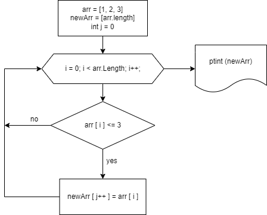

# Итоговая работа.
## ***Задача:*** 
Написать программу, которая из имеющегося массива строк формирует массив из строк, длина которых меньше либо равна 3 символа. 
Первоначальный массив можно ввести с клавиатуры, либо задать на старте выполнения алгоритма. 
При решении не рекомендуется пользоваться коллекциями, лучше обойтись исключительно массивами. 

## ***Алгоритм решения:***

1. Создаем 2 массива строк.
2. Один массив заполняем строками.
3. Просим пользователя ввести слова.
4. Заполняем при помощи цикла for.
5. Создаем метод formingNewArray.
6. Определяем длину элемента массива. Еси элемент имеет длину меньше или равную 3 символам, добавляем в пустой массив.
7. Выводим сформированный мвссив в консоль.

# Блок-схема алгоритма

